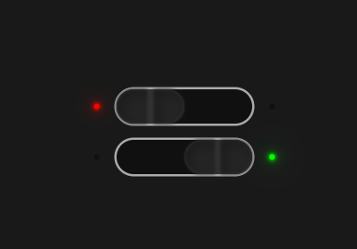

# CSS-Toggle

A simple css file to decorate check boxes, turning them into toggle like buttons. The majority of this code comes from this [YouTube](https://www.youtube.com/watch?v=bq1SpzD8X2s) video I seen by [Online Tutorials](https://www.youtube.com/channel/UCbwXnUipZsLfUckBPsC7Jog). I then extracted out the values and colors placing them into CSS variables. I then made all the ratios based off the controls width, which is the only value you really should need to edit outside of the colors and transition speed.



## Usage

You just need to download the toggle.css file and place it into your project folder. You can edit the colors to your preferences, below is a reference image to what variable controls what part of the toggle.

```html
<head>
  ...
  <link rel="stylesheet" href="toggle.css" />
  ...
</head>
<body>
  <label class="toggle-class">
    <input type="checkbox" name="" />
    <span class="toggle-check"></span>
    <span class="toggle-button"></span>
  </label>
</body>
```

Besides the colors, feel free to edit the width to your desired size and the animation transition speed. Originally it was 0.5s but I found that a little slow, so now it is defaulted to 0.25s.


## Color Reference


## License

[MIT](https://choosealicense.com/licenses/mit/) -- Please give credit to the [Online Tutorials](https://www.youtube.com/channel/UCbwXnUipZsLfUckBPsC7Jog) YouTube channel
